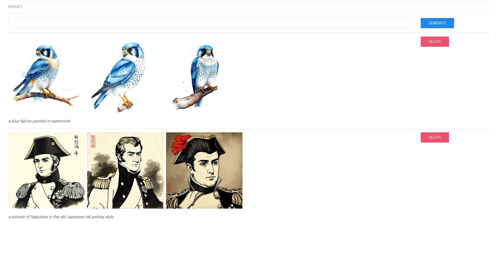

# Larzish

A simple tool to generate unlimited AI images with flux

## Usage

Just `go run .`

A Web UI is then the accessible at `http://localhost:8080`

Just enter your prompt and press `GENERATE`. Click on any image to download it.

## Screenshots

